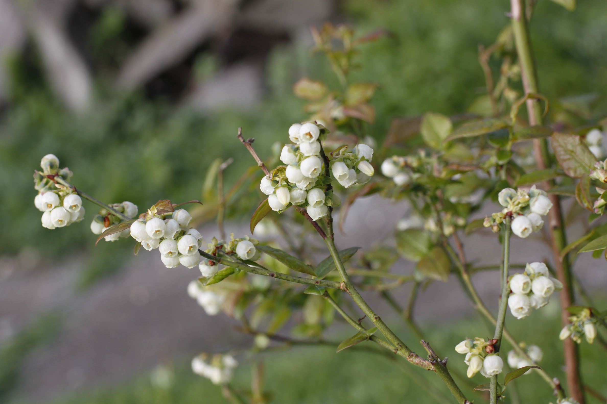
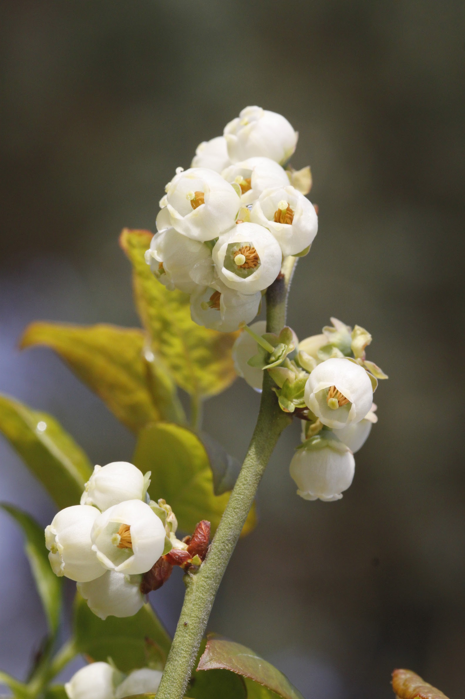
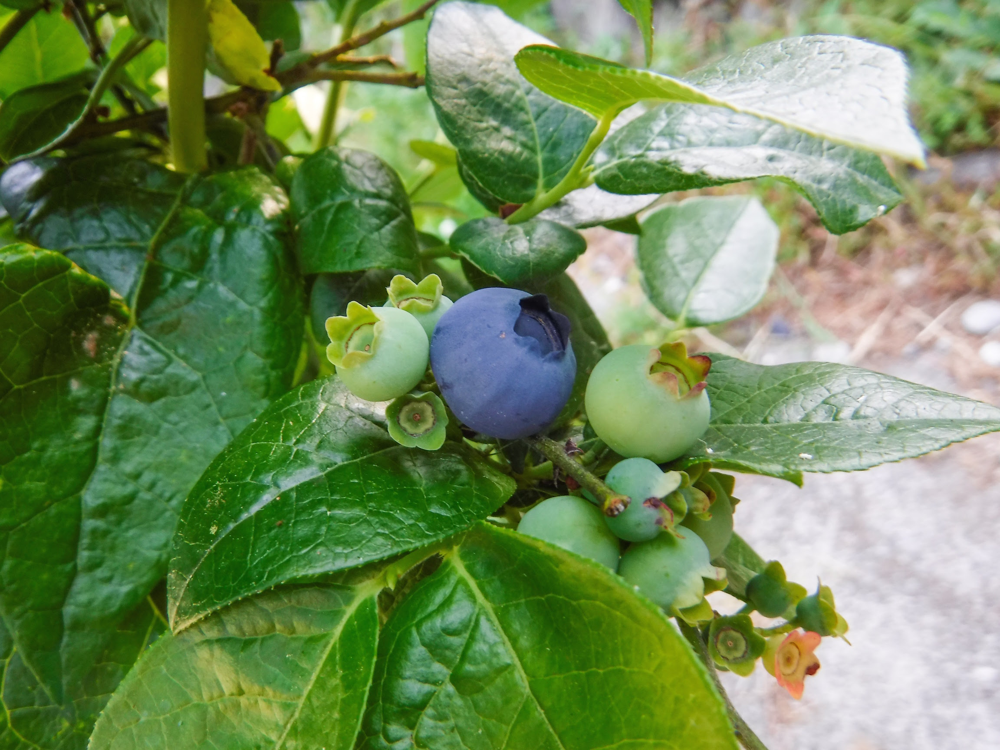

# Blueberries

Blueberry plants are upright bushes that produce small to medium sized dark blue berries. They are native to North America.

Blueberries are excellent eaten fresh when fully ripe and make fantastic jams and smoothies.

All dates below are for the Seattle, WA area (maritime pacific zone 8b).

## Unknown Variety (Blueberry)

  
  
  

  

    
      <strong>Botanical Name</strong>: Unknown
    
    
      <strong>USDA Zones</strong>: 8
    
  

  

    
      <strong>History</strong>: Purchased from Home Depot or Lowes in 2012 or 2013 in Seattle. Could be Bluecrop, Blueray, or a handful of other varieties.
    
  

  

    
      <strong>Type</strong>: Half-high or highbush
    
    
      <strong>Form</strong>: Bush (2m tall)
    
    
      <strong>Habit</strong>: Upright
    
  

  

    
      <strong>Pollinators</strong>: Self-pollinating
    
    
      <strong>Years to fruit</strong>: 2-3
    
  

  

    
      <strong>Flower</strong>: White flowers in bunches form from near the tips of branches and shoots in the early spring.
    
  

  

    
      <strong>Fruit</strong>: Medium-sized, firm sweet blue berries form during summer and fall. Pick frequently as berries ripen over a long period. Berries turn blue well before ripening.
    
  

  

    
      <strong>Soil</strong>: Well-drained acidic loamy (pH 4.0 - 5.0)
    
  

  

    
      <strong>Light</strong>: Full sun
    
  

  

    
      <strong>Bud break</strong>: Early March
    
    
      <strong>Bloom</strong>: Early March
    
    
      <strong>Harvest</strong>: July
    
  

