# Currants

Currants are bushes that grow strigs of small blueberry-sized berries that are sweet tart when ripe. There are two main kinds of currants: red and black. Red currants come in several colors such as red, pink, or white and have a milder flavor. Black currants range from dark purple to jet black and have a unique musky scent in both their leaves and berries.

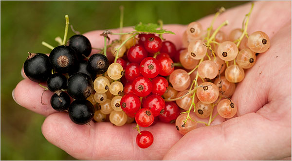

Currants are very popular in Europe, but hardly available commercially in the U.S. due mostly to a federal ban on growing them enacted in 1920. In 1966 the federal ban was lifted, however it is still banned to grow currants in some states because they are an alternate host for white pine blister rust.

Currants can be eaten fresh when fully ripe and make excellent jams, jellies, and juice.

> Ribes is a little bushe ... and in the tops ... are red berries in clusters in taste at the first somethinge sower but pleasant enough when they are fully ripe.
>
> -- <cite>William Turner, 1568</cite>

All dates below are for the Seattle, WA area (maritime pacific zone 8b).

## Pink Champagne (Pink Currant)

  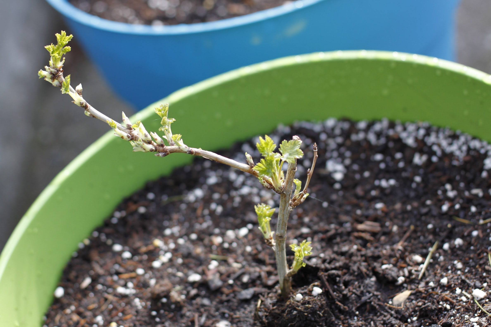
  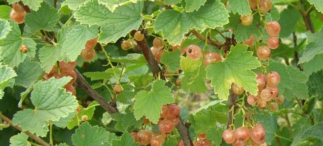
  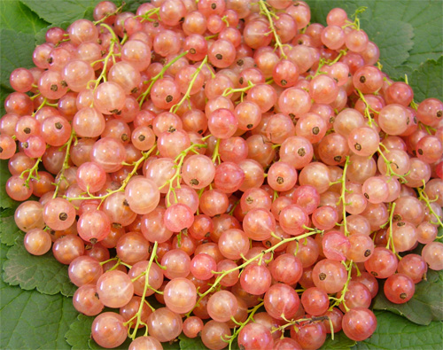
  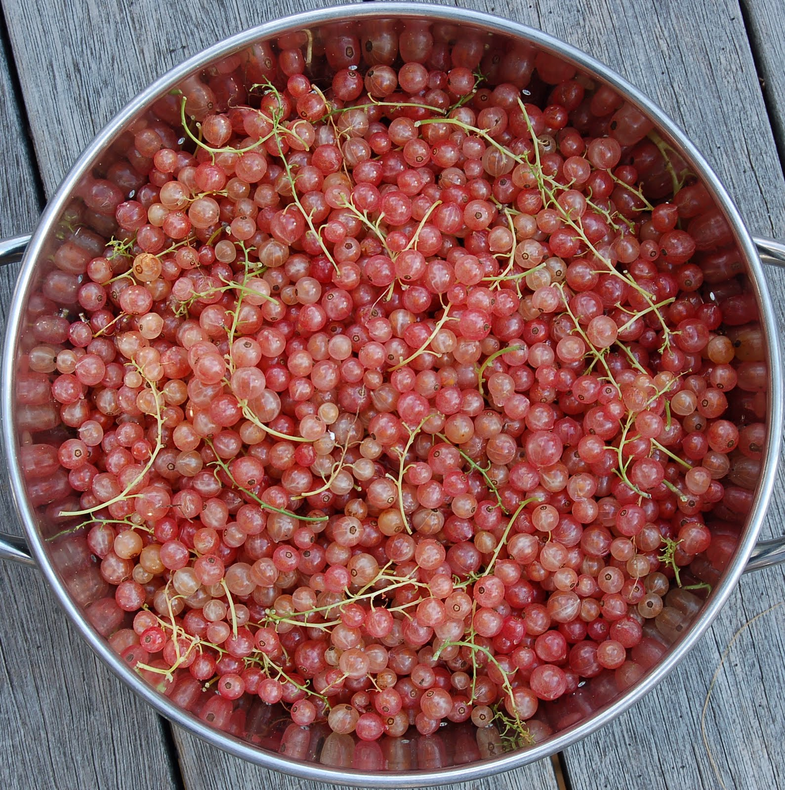

  

    
      <strong>Botanical Name</strong>: Ribes rubrum L.
    
    
      <strong>USDA Zones</strong>: 3 - 7
    
  

  

    
      <strong>History</strong>: Unknown parentage, probably common red &#10005; common white. Antique European variety possibly from France.
    
  

  

    
      <strong>Type</strong>: Red currant
    
    
      <strong>Form</strong>: Bush (1.5m tall)
    
    
      <strong>Habit</strong>: Vigorous upright
    
  

  

    
      <strong>Pollinators</strong>: Self-pollinating
    
    
      <strong>Years to fruit</strong>: 1-2
    
  

  

    
      <strong>Flower</strong>: Strigs of white/green flowers form at buds in Spring.
    
  

  

    
      <strong>Fruit</strong>: Strigs of firm translucent pink to white berries. Less tart than a typical red currant. Yield is a bit lower than most red currants.
    
  

  

    
      <strong>Soil</strong>: Well-drained loamy to sandy (pH 6.0 - 6.8)
    
  

  

    
      <strong>Light</strong>: Partial shade to full sun
    
  

  

    
      <strong>Bud break</strong>: Late March
    
    
      <strong>Bloom</strong>: Mid April
    
    
      <strong>Harvest</strong>: Early July
    
  

## Primus (White Currant)

  
  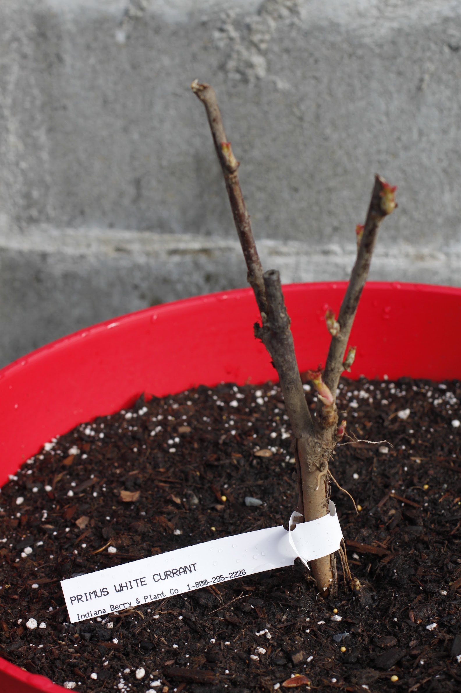
  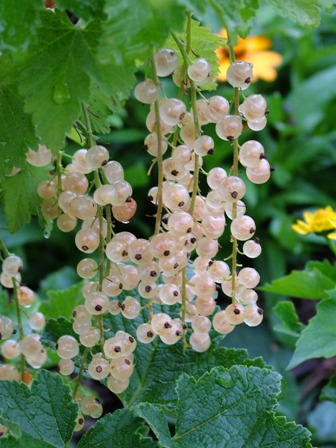

  

    
      <strong>Botanical Name</strong>: Ribes spicatum E. Robson
    
    
      <strong>USDA Zones</strong>: 3 - 8
    
  

  

    
      <strong>History</strong>: Parentage is Heinemann's Rote Spatlese &#10005; <a href="#red-lake-red-currant">Red Lake</a>, but has lost its red pigment in the berries. Has a neat red pigment in young branches, however. Bred by Dr. Josef Cvopa at Bojnice, Slovakia and released in 1977 from the Research Institute of Fruit and Decorative Trees.
    
  

  

    
      <strong>Type</strong>: Red currant
    
    
      <strong>Form</strong>: Bush (1.5m tall)
    
    
      <strong>Habit</strong>: Vigorous upright
    
  

  

    
      <strong>Pollinators</strong>: Self-pollinating
    
    
      <strong>Years to fruit</strong>: 1-2
    
  

  

    
      <strong>Flower</strong>: Strigs of white/green flowers form at buds in Spring.
    
  

  

    
      <strong>Fruit</strong>: Strigs of firm translucent white berries. Less tart than a typical red currant. Sweet and high in vitamin C.
    
  

  

    
      <strong>Soil</strong>: Well-drained loamy to sandy (pH 6.0 - 6.8)
    
  

  

    
      <strong>Light</strong>: Partial shade to full sun
    
  

  

    
      <strong>Bud break</strong>: Early April
    
    
      <strong>Bloom</strong>: Late April
    
    
      <strong>Harvest</strong>: Late July
    
  

## Red Lake (Red Currant)

  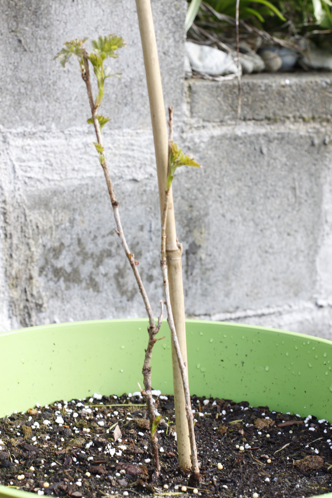
  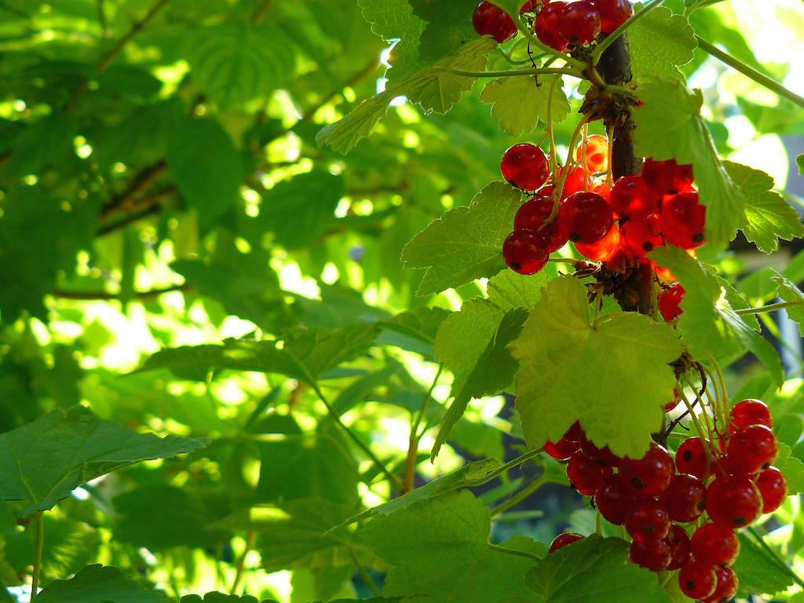

  

    
      <strong>Botanical Name</strong>: Ribes spicatum E. Robson
    
    
      <strong>USDA Zones</strong>: 3 - 7
    
  

  

    
      <strong>History</strong>: Commercially introduced in 1933 by the University of Minnesota. Bred by William Horace Alderman at the Agricultural Experiment Station in Excelsior, Minnesota. Originally called Minnesota No. 24, this cultivar began to attract attention around 1920 when it was growing in a test plot with other seedlings of unknown parentage.
    
  

  

    
      <strong>Type</strong>: Red currant
    
    
      <strong>Form</strong>: Bush (1m tall)
    
    
      <strong>Habit</strong>: Upright
    
  

  

    
      <strong>Pollinators</strong>: Self-pollinating
    
    
      <strong>Years to fruit</strong>: 1-2
    
  

  

    
      <strong>Flower</strong>: Strigs of white/green flowers form at buds in Spring.
    
  

  

    
      <strong>Fruit</strong>: Strigs of firm tart bright red berries.
    
  

  

    
      <strong>Soil</strong>: Well-drained loamy to sandy (pH 6.0 - 6.8)
    
  

  

    
      <strong>Light</strong>: Partial shade to full sun
    
  

  

    
      <strong>Bud break</strong>: Late March
    
    
      <strong>Bloom</strong>: Mid April
    
    
      <strong>Harvest</strong>: Early July
    
  

## Slitsa (Black Currant)

  
  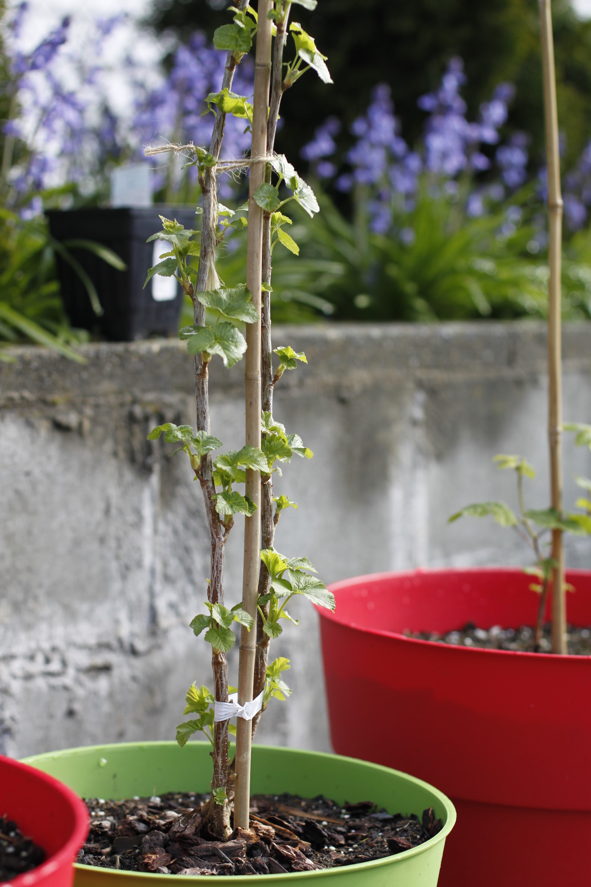
  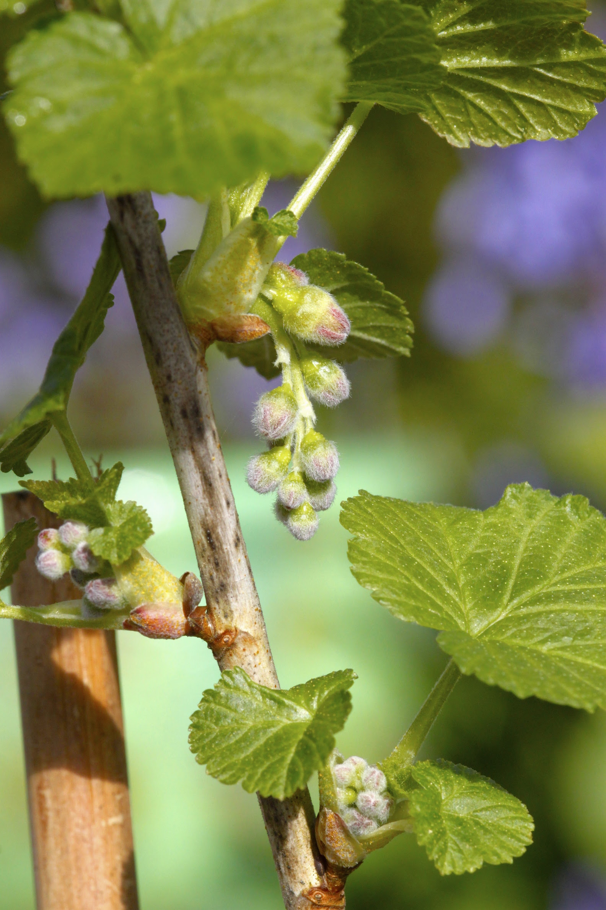
  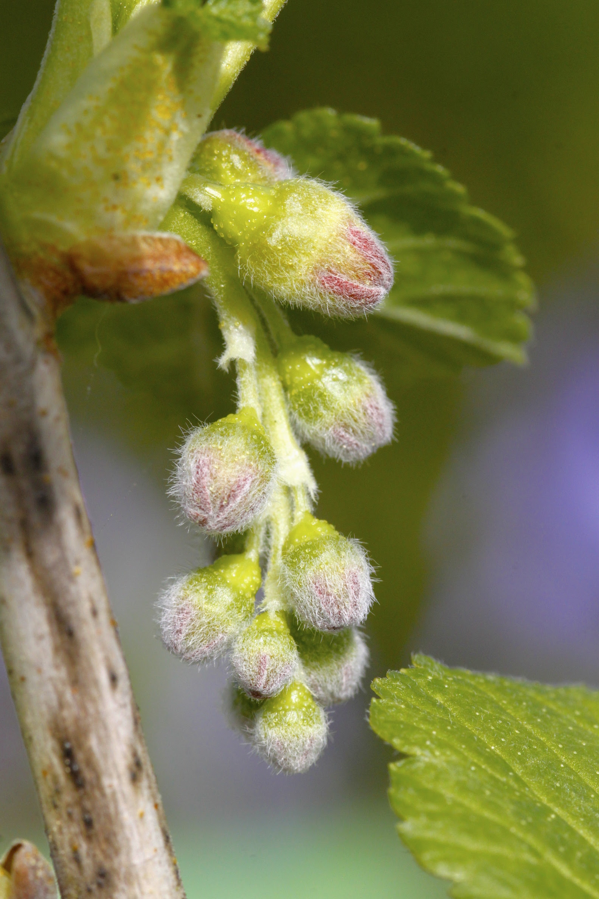
  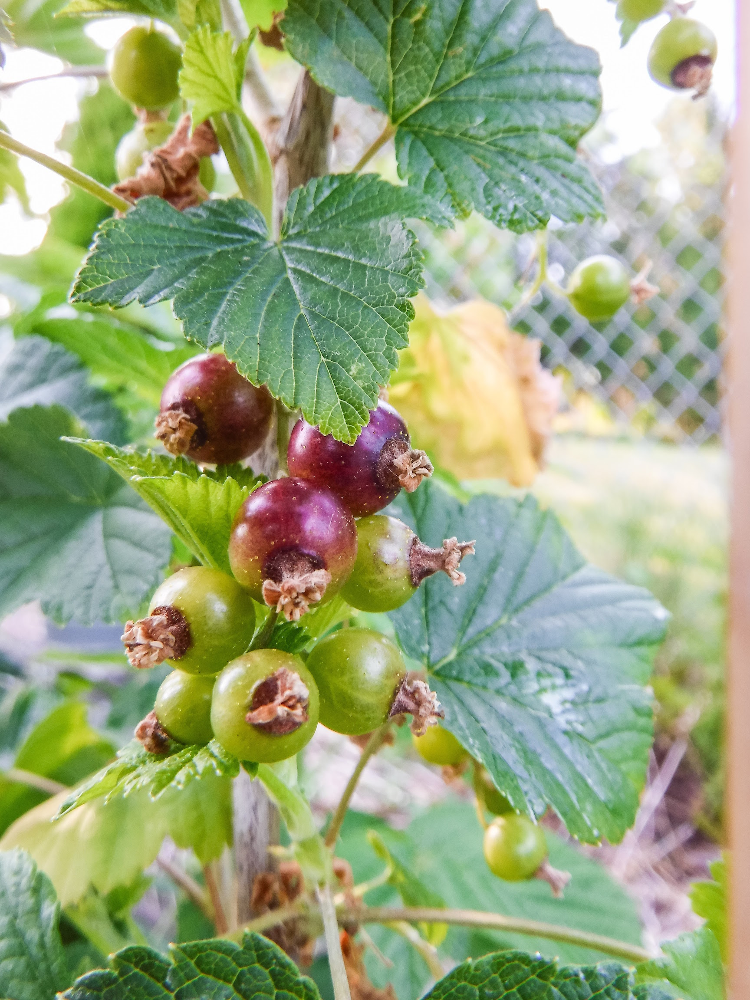
  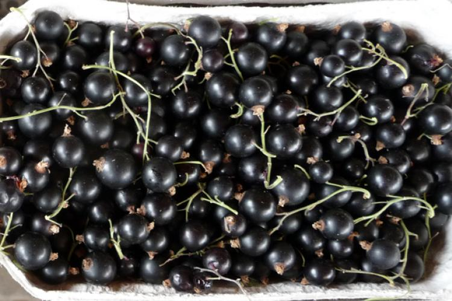

  

    
      <strong>Botanical Name</strong>: Ribes nigrum L.
    
    
      <strong>USDA Zones</strong>: 3 - 7
    
  

  

    
      <strong>History</strong>: A selection of R. nigrum from Holland.
    
  

  

    
      <strong>Type</strong>: Black currant
    
    
      <strong>Form</strong>: Bush (1.5m tall)
    
    
      <strong>Habit</strong>: Vigorous upright
    
  

  

    
      <strong>Pollinators</strong>: Self-pollinating
    
    
      <strong>Years to fruit</strong>: 1
    
  

  

    
      <strong>Flower</strong>: Strigs of purple flowers form at buds in Spring.
    
  

  

    
      <strong>Fruit</strong>: Strigs of firm jet black berries. Sweet and less musky than other black currant varieties. About 10 berries per strig.
    
  

  

    
      <strong>Soil</strong>: Well-drained loamy to sandy (pH 6.0 - 6.8)
    
  

  

    
      <strong>Light</strong>: Partial shade to full sun
    
  

  

    
      <strong>Bud break</strong>: Early March
    
    
      <strong>Bloom</strong>: March / April
    
    
      <strong>Harvest</strong>: Early July
    
  

