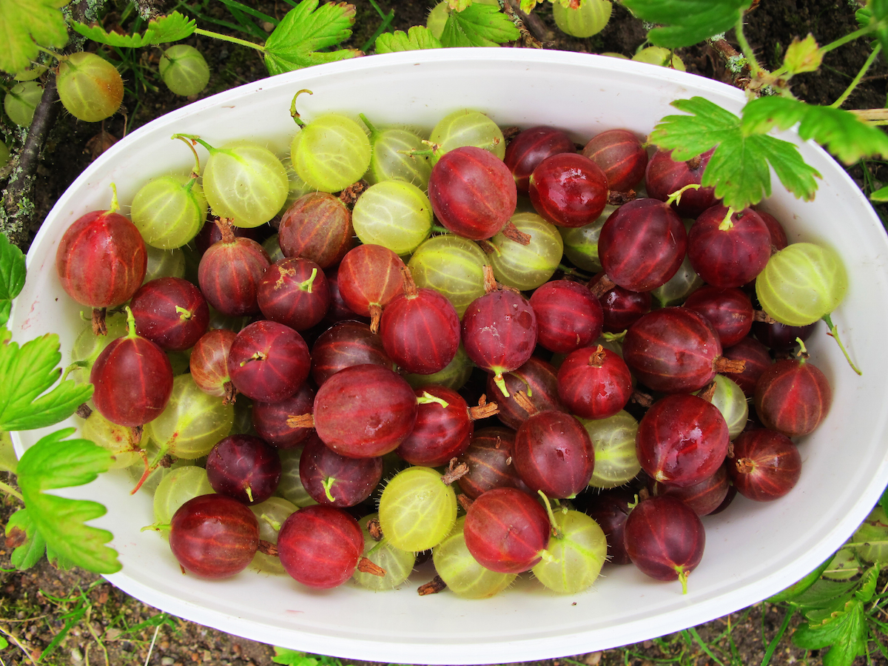
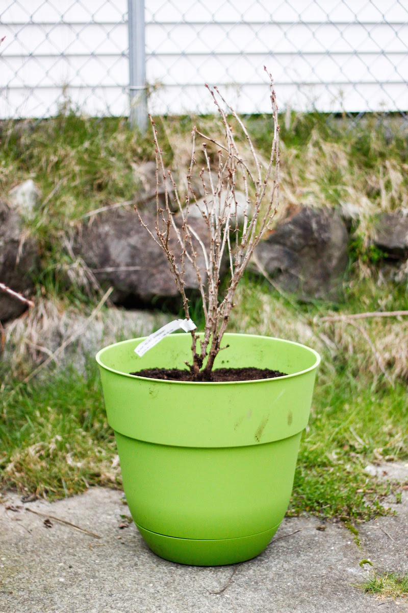
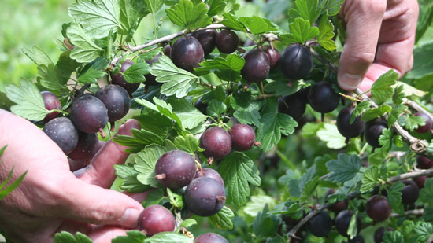
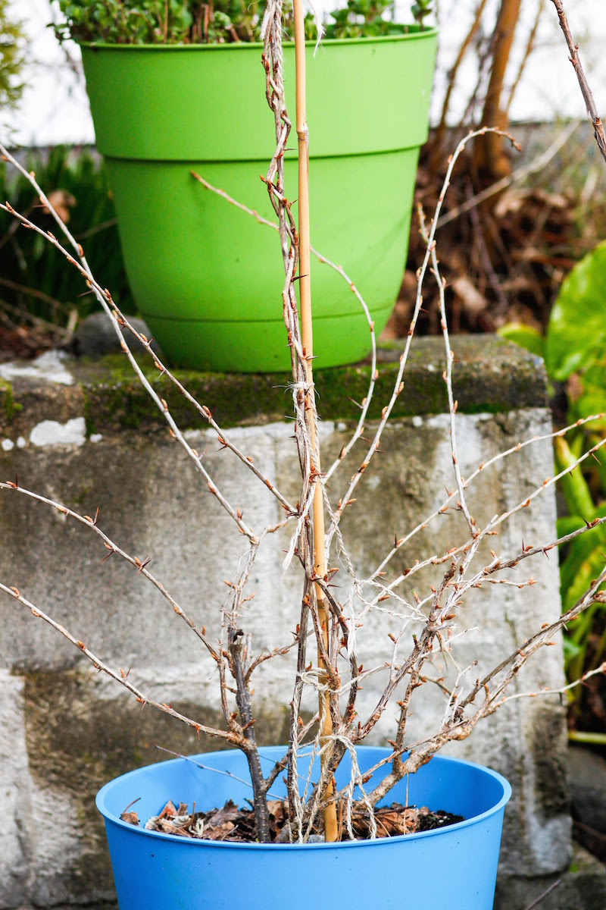
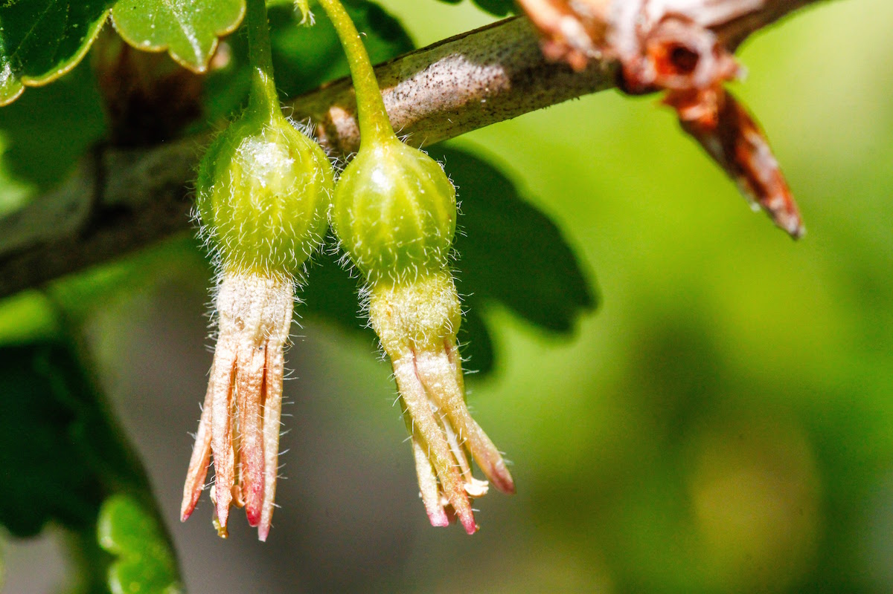
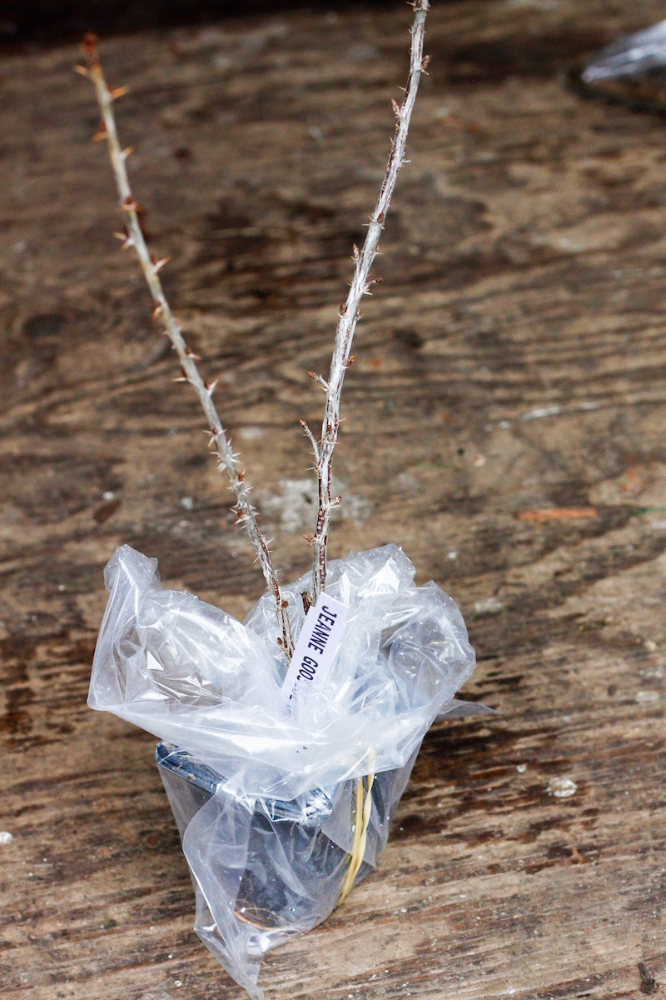
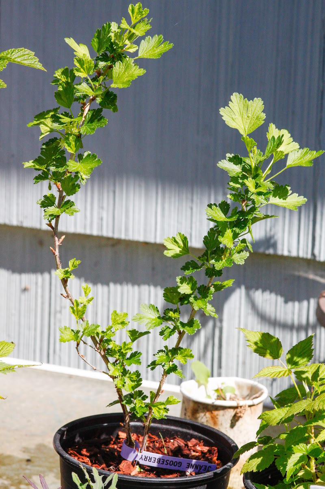
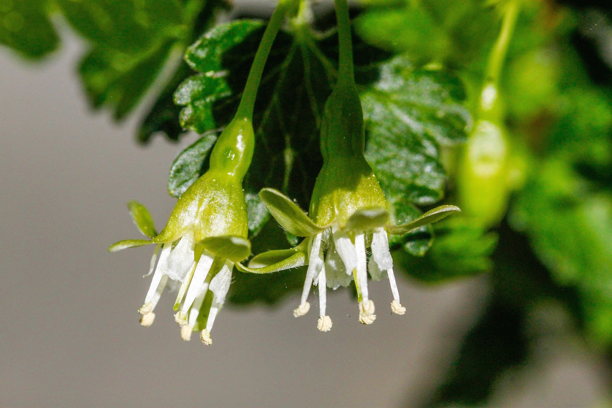
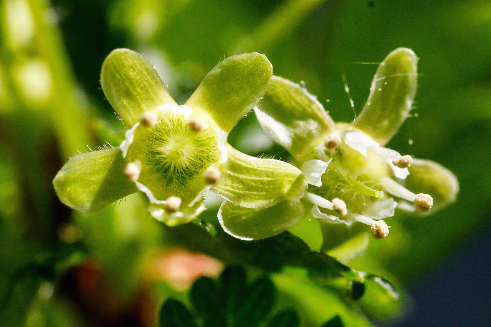

# Gooseberries

Gooseberries are bushes that grow blueberry to grape-sized berries with their own unique flavor that are sweet tart when ripe. The berries have visible veins and range in color from green, blushed pink, red, purple, and even black or white. The bushes have thorns but some varieties have few or small thorns, while for others the berries are far enough from the branches to make picking easier. The bushes live and produce berries for 25 years and sometimes more! All gooseberries require about 1000 - 1200 chill hours to break dormancy and produce fruit.

Gooseberries are very popular in Europe, but hardly available commercially in the U.S. due mostly to a federal ban on growing them enacted in 1920. In 1966 the federal ban was lifted, however it is still banned to grow gooseberries in some states because they are an alternate host for white pine blister rust.

Gooseberries can be eaten fresh when fully ripe and make excellent jams, jellies, and pies.

All dates below are for the Seattle, WA area (maritime pacific zone 8b).

## Black Velvet (Gooseberry)

  
  
  

  

    
      <strong>Botanical Name</strong>: Ribes uva-crispa L.
    
    
      <strong>USDA Zones</strong>: 4 - 8
    
  

  

    
      <strong>History</strong>: A cross between the European 'Red Champagne' gooseberry and a native 'Worcesterberry' (Ribes divaricatum).
    
  

  

    
      <strong>Type</strong>: Gooseberry
    
    
      <strong>Form</strong>: Bush (1.5m tall)
    
    
      <strong>Habit</strong>: Vigorous upright
    
  

  

    
      <strong>Pollinators</strong>: Self-pollinating
    
    
      <strong>Years to fruit (cutting)</strong>: 1
    
  

  

    
      <strong>Flower</strong>: Small groups of one to three red-blushed white flowers form at buds in Spring after leaves have grown.
    
  

  

    
      <strong>Fruit</strong>: Small groups of one to three dark purple berries. Described as a "unique but interesting" flavor. Dessert quality.
    
  

  

    
      <strong>Soil</strong>: Well-drained loamy to sandy (pH 5.5 - 6.8)
    
  

  

    
      <strong>Light</strong>: Partial shade to full sun
    
  

  

    
      <strong>Bud break</strong>: Late March
    
    
      <strong>Bloom</strong>: Early April
    
    
      <strong>Harvest</strong>: July
    
  

## Hinnomaki Red (Gooseberry)

  
  
  

  

    
      <strong>Botanical Name</strong>: Ribes uva-crispa L.
    
    
      <strong>USDA Zones</strong>: 3 - 9
    
  

  

    
      <strong>History</strong>: Developed at the Lepaa Horticultural College in Finland in the 1930's from a wild disease-resistant specimen. Originally called "Lepaa Red" but renamed to Hinnomaki Red. Also called Hinnonmaki Red or Hinomaki Red, which is just a shortened version of the Finnish name.
    
  

  

    
      <strong>Type</strong>: Gooseberry
    
    
      <strong>Form</strong>: Bush (1m tall)
    
    
      <strong>Habit</strong>: Spreading
    
  

  

    
      <strong>Pollinators</strong>: Self-pollinating
    
    
      <strong>Years to fruit (cutting)</strong>: 1
    
  

  

    
      <strong>Flower</strong>: Small groups of one to three pink-blushed white flowers form at buds in Spring after leaves have grown.
    
  

  

    
      <strong>Fruit</strong>: Small groups of one to three red berries. Described as having tart skin with sweet flesh. Dessert quality.
    
  

  

    
      <strong>Soil</strong>: Well-drained loamy to sandy (pH 5.5 - 6.8)
    
  

  

    
      <strong>Light</strong>: Partial shade to full sun
    
  

  

    
      <strong>Bud break</strong>: Late March
    
    
      <strong>Bloom</strong>: Early April
    
    
      <strong>Harvest</strong>: July
    
  

## Jeanne (Gooseberry)

  
  
  
  

  

    
      <strong>Botanical Name</strong>: Ribes uva-crispa L.
    
    
      <strong>USDA Zones</strong>: 3 - 7
    
  

  

    
      <strong>History</strong>: Released in 2006 by the USDA Agricultural Research Service in Corvallis, Oregon after more than 20 years of study. It was donated to the USDA ARS NCGR in 1981 and is of an unknown mixed European/American gooseberry pedigree. It was named after Ms. Cheryl Jeanne Gunning, who worked in the tissue culture laboratory from 1981 to 1985. This variety is highly resistant to white pine blister rust and powdery mildew while having small thorns and dessert quality fruit.
    
  

  

    
      <strong>Type</strong>: Gooseberry
    
    
      <strong>Form</strong>: Bush (1m tall)
    
    
      <strong>Habit</strong>: Upright
    
  

  

    
      <strong>Pollinators</strong>: Self-pollinating
    
    
      <strong>Years to fruit (cutting)</strong>: 1
    
  

  

    
      <strong>Flower</strong>: Small groups of one to two white flowers form at buds in Spring after leaves have grown.
    
  

  

    
      <strong>Fruit</strong>: Small groups of one to two deep red berries. Dessert quality. About 1.5kg per plant.
    
  

  

    
      <strong>Soil</strong>: Well-drained loamy to sandy (pH 5.5 - 6.8)
    
  

  

    
      <strong>Light</strong>: Partial shade to full sun
    
  

  

    
      <strong>Bud break</strong>: Late March
    
    
      <strong>Bloom</strong>: Mid April
    
    
      <strong>Harvest</strong>: July
    
  

