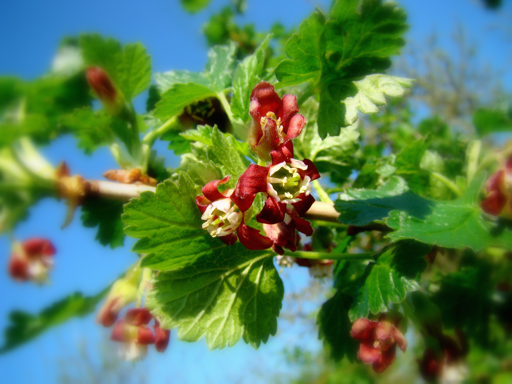
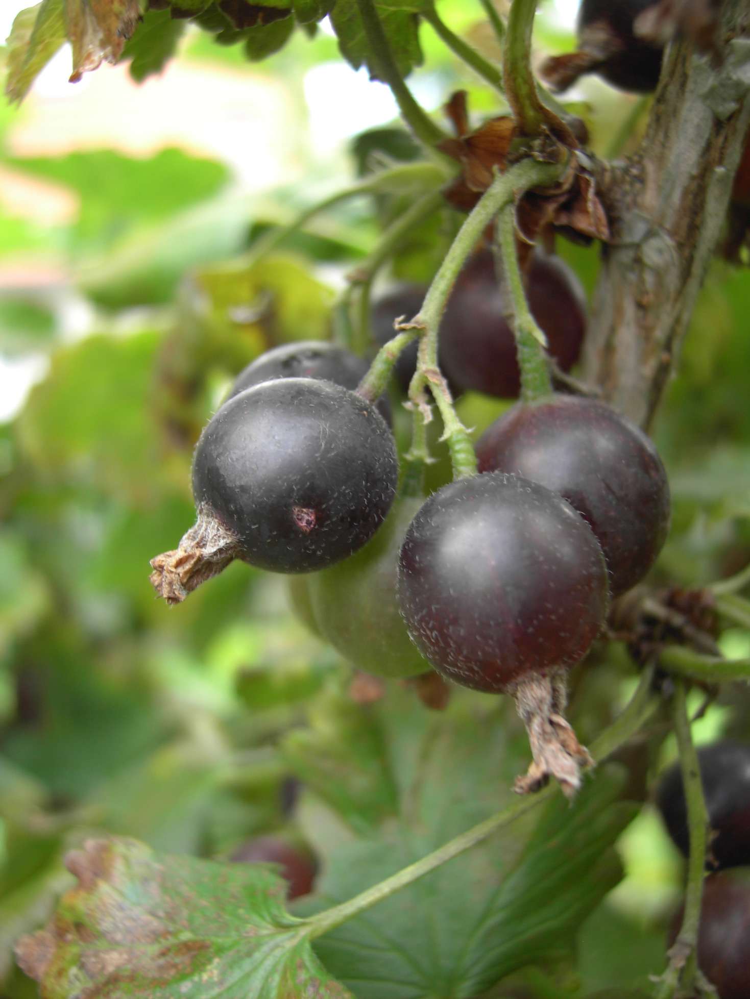
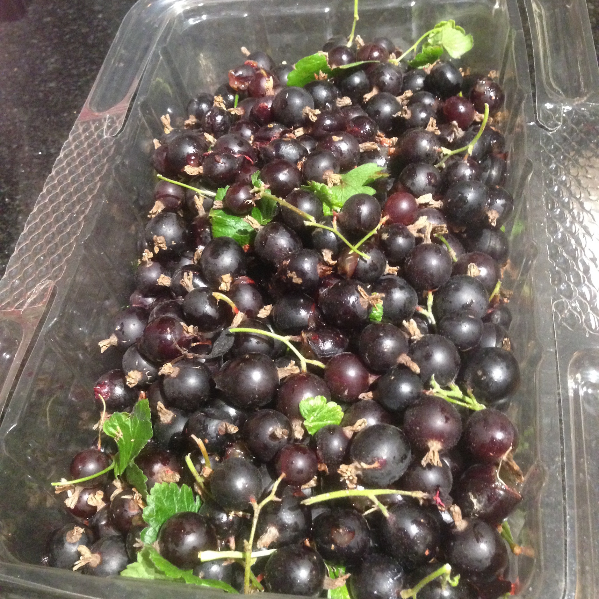

# Jostaberries

Jostaberries (pronounced "yostaberries") are bushes that grow clusters of small to medium berries that are sweet tart when ripe. First released in 1977, they are a tetraploid complex cross of the black currant R. nigrum, the North American coastal black gooseberry R. divaricatum, and the European gooseberry R. uva-crispa. Developed in Germany, the name is from the German words "<em>Jo</em>hannisbeere" (currant) and "<em>Sta</em>chelbeere" (gooseberry). Today several different varieties are available.

Jostaberries can be eaten fresh when fully ripe and make excellent jams, jellies, and juice.

All dates below are for the Seattle, WA area (maritime pacific zone 8b).

## Jostaberry

  
  
  
  

  

    
      <strong>Botanical Name</strong>: Ribes nidigrolaria R. Bauer & A. Bauer
    
    
      <strong>USDA Zones</strong>: 3 - 8
    
  

  

    
      <strong>History</strong>: The original jostaberry, developed in the 1955 in Breitbrunn West Germany by Dr. Rudolph Bauer and released in 1977. Open pollinated F2 cross of ('Silvergieters Schwarze' R. nigrum &#10005; 'Grüne Hansa' R. uva-crispa) &#10005; ('Langtraubige Schwarze' R. nigrum &#10005; R. divaricatum). The process to merge these fruits began in 1883, however ran into problems with fruit set that were eventually solved with a chemical treatment called colchicine.
    
  

  

    
      <strong>Type</strong>: Jostaberry
    
    
      <strong>Form</strong>: Bush (2m tall)
    
    
      <strong>Habit</strong>: Vigorous upright
    
  

  

    
      <strong>Pollinators</strong>: Self-pollinating
    
    
      <strong>Years to fruit</strong>: 1
    
  

  

    
      <strong>Flower</strong>: Clusters of reddish-purple flowers form at buds in Spring.
    
  

  

    
      <strong>Fruit</strong>: Clusters of firm very dark pruple to black fruit form with 3-5 berries. Size is between a black currant and a gooseberry, as is the flavor. Ripens unevenly, so pick multiple times.
    
  

  

    
      <strong>Soil</strong>: Well-drained loamy to sandy (pH 6.0 - 6.8)
    
  

  

    
      <strong>Light</strong>: Partial shade to full sun
    
  

  

    
      <strong>Bud break</strong>: March
    
    
      <strong>Bloom</strong>: April
    
    
      <strong>Harvest</strong>: Late June - July
    
  

