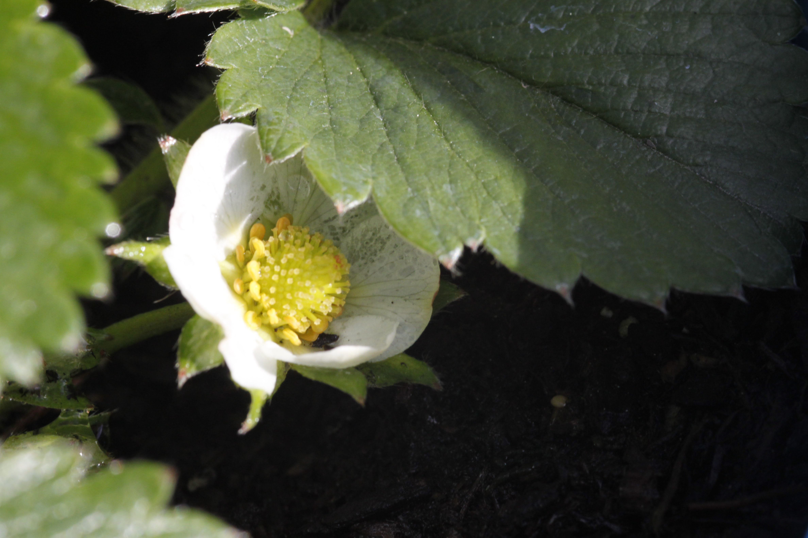
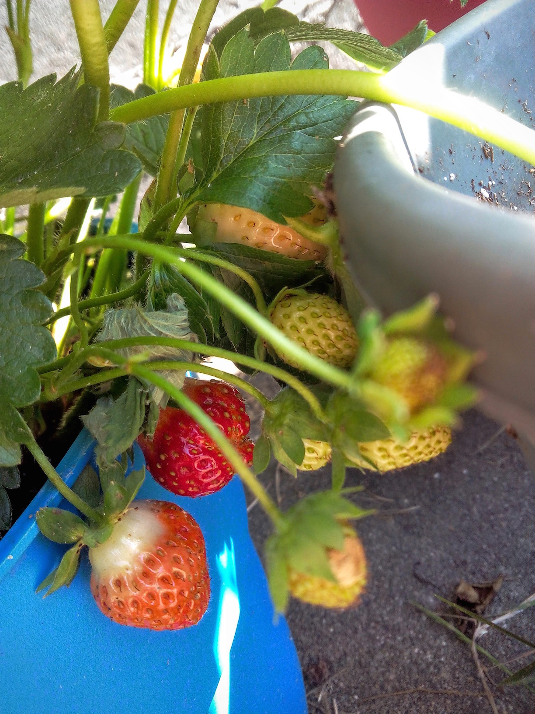
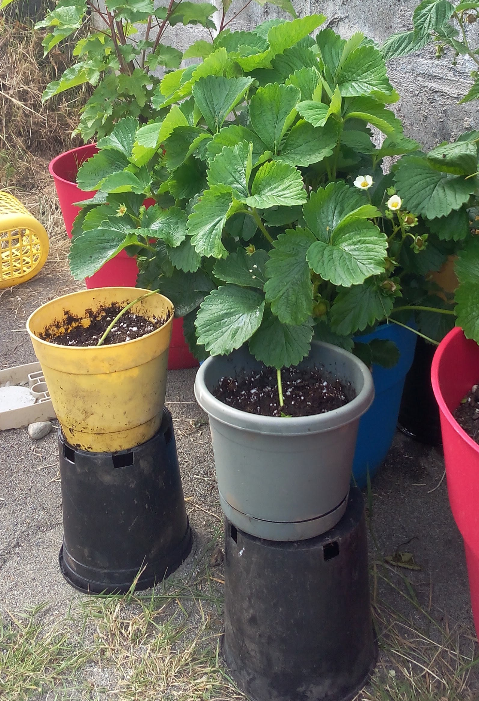

# Strawberries

Strawberry plants are small forbs with a crown that grows shoots for leaves, flowers and fruit. The strawberry itself is an aggregate accessory fruit and what most people consider the "seeds" on the outside of the berry are actually the true botanical fruits. Strawberries come in a variety of colors from red to deep red, yellow and white. Production of berries depends on the type: june-bearing, everbearing, or day-neutral.

June bearing strawberries produce one large crop in June. The rest of the year they do not produce berries. Everbearing varieties produce two main crops, one in summer and one in the fall with a few berries in between. Day-neutral strawberries produce fruit continuously from spring until frost. Most cultivated varieties produce a similar total amount of fruit, the main difference is how spread out the production is. June-bearing types can be great for preserves, while day-neutral types are good for a constant supply of berries.

Strawberries are excellent eaten fresh when fully ripe and make fantastic jams and smoothies.

All dates below are for the Seattle, WA area (maritime pacific zone 8b).

## Ozark Beauty (Strawberry)

  
  
  

  

    
      <strong>Botanical Name</strong>: Fragaria &#10005; ananassa
    
    
      <strong>USDA Zones</strong>: 4-8
    
  

  

    
      <strong>History</strong>: Released in 1955 by J.B. Winn of Arkansas. Cross of 'Red Rich' &#10005; 'Twentieth Century'. Propagates easily through many runners.
    
  

  

    
      <strong>Type</strong>: Everbearing
    
    
      <strong>Form</strong>: Forb (40cm tall)
    
    
      <strong>Habit</strong>: Vigorous spreading
    
  

  

    
      <strong>Pollinators</strong>: Self-pollinating
    
    
      <strong>Years to fruit</strong>: 1
    
  

  

    
      <strong>Flower</strong>: White and yellow flowers form from shoots coming out of the crown during spring and fall.
    
  

  

    
      <strong>Fruit</strong>: Medium-sized, firm sweet red berries form during summer and fall. Pick frequently as berries ripen over a long period.
    
  

  

    
      <strong>Soil</strong>: Well-drained loamy (pH 5.5 - 6.5)
    
  

  

    
      <strong>Light</strong>: Full sun
    
  

  

    
      <strong>Bud break</strong>: February
    
    
      <strong>Bloom</strong>: April
    
    
      <strong>Harvest</strong>: June / September
    
  

